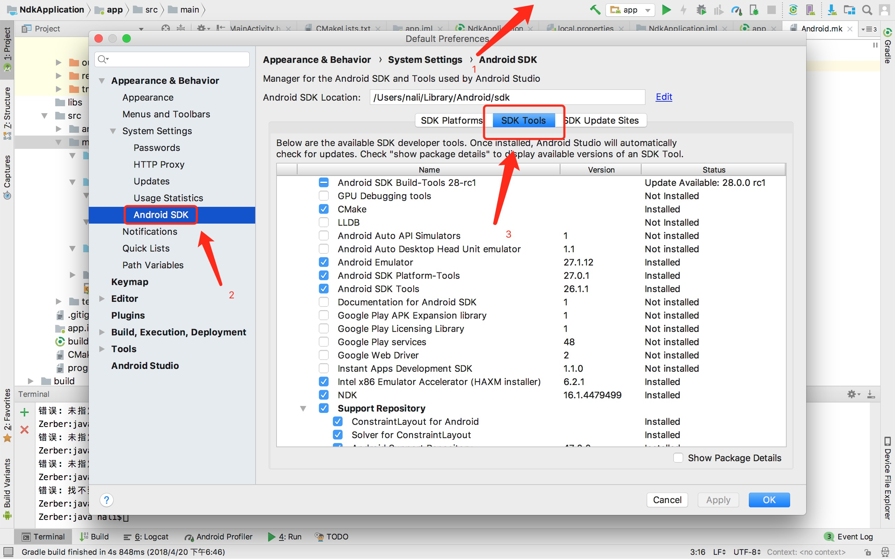
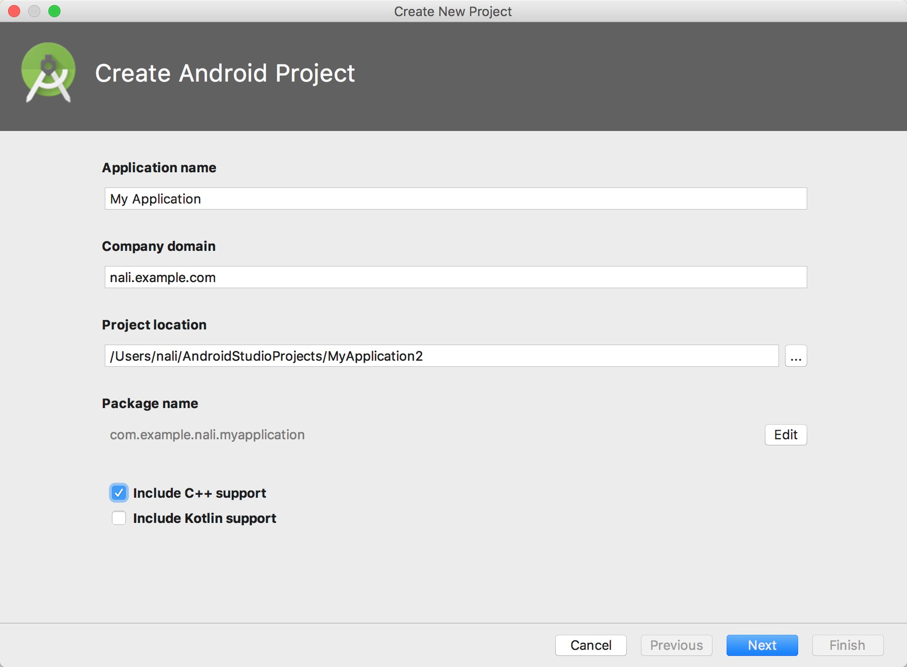
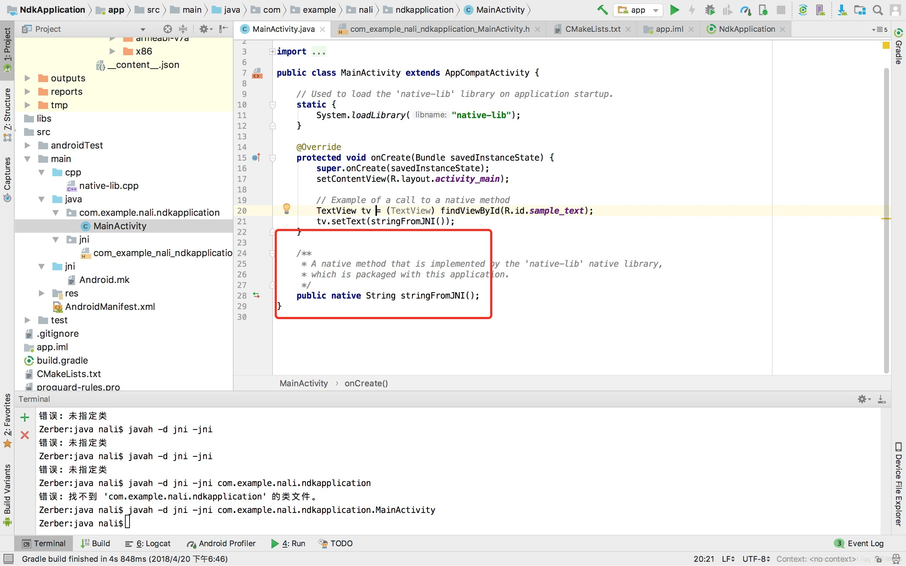

最近老大让我开发一个流媒体播放器，这里面需要用到NDK，大家都是在平时的过程中熟悉使用了JDK，很少使用NDK

<!--more-->

NDK是个什么玩意呢？
让我们对以下几个概念做一个解释：

```
SDK:(Software Development Kit)软件开发工具包;这是一个覆盖面相当广泛的名词，可以这么说：辅助开发某一类软件的相关文档、API必需资料、范例和工具的集合都可以叫做 "SDK"。在安卓开发中我们所说的SDK即为android SDK，它为开发者提供了库文件以及其他开发所用到的工具；一般说的SDK就是开发工具了，再加一个开发IDE，就搭建起一个开发环境了，比如 eclipse + android SDK 的IDE

NDK:(Native Development Kit)跟android SDK差不多也是一个开发工具包，是用来给安卓手机开发软件用的，但是和SDK不同的是它用的是C语言，而android SDK用的是Java语言；

JDK:(Java Development Kit) Java语言的软件开发工具包，Java核心，包括Java运行环境、类库、Java开发工具，简单的说JDK就是面向Java开发人员使用的SDK ；

ADT:(Android Developer Tools),安卓开发工具，Google研发的一个插件，集成在eclipse中，为安卓开发提供专属开发环境，简单的说ADT就是Android在Eclipse上的开发工具，在Eclipse和SDK之间起到了一个桥梁的作用；

ANT:是Apache的一个项目管理工具，是一个可将软件编译、测试、部署等步骤联系在一起加以自动化的工具，大多用于Java环境中的软件开发。
```

总而言之就是我们利用C和C++来给Android来写程序
我们通过JNI来实现JAVA和C、C++之间的通信(详细信息便不再说明)

这里我主要来说一下，我打通从手机的adb到mac之间的一些操作
刚开始我下了一个Android Studio，你们知道AS本身带有很强大的下载JDK包的功能，我就顺手利用AS下了NDK

```
过程为：Tools->SDK Manager->Android SDK->SDK Tools
```


(当然前两部省略在上面隐形了)

当然，此时安装好以后我们就可以新建一个C++的项目了，比如:

自然而然的生成一个项目

这个时候我们可以看到这么一个项目

我们可以看到这部分基本都是自动生成的

在这里我们可以打开MainActivity

假设我们写一个函数，便会生成一个基本函数
但是这样还是不够的
我们还需要JNI来打通C、C++和Java之间的通道
底下便是终端

我们需要到java文件夹下输入

```
javah -d jni -jni com.example.nali.ndkapplication.MainActivity
```

生成.h头文件

一般这个时候点编译和run，就能输出最基本的app了，可以运行了

当然这个是打通我们和手机的第一步，就是可以利用AS编译NDK了，剩下的我们要对流媒体算法本身进行封装，要打通手机和shell之间的通道，利用adb shell，打开手机，并在终端上写下一个hello world！

这个配置就配置很久了，看了网上的很多很多攻略，汇总在下面这里：

#### 1. ndk-build

找了大部分网上对于ndk包的处理，大部分都是直接下载android的ndk包

比如:

```
H:\gp\Android\android-ndk-r9
```

这种配置
对于它们都比较好配置路径，而我的ndk包是从AS上下载下来的，所以路径不太一样

我的路径是:
```
/Users/nali/Library/Android/sdk/ndk-bundle
```

这个时候我们想使用ndk-build这个命令，但是其他文件夹并不能使用，这个时候我们需要配置一下这个命令

##### 1. 进入当前用户的home目录
输入

```  
cd ～ (注意中间的空格)
```

##### 2. 创建 .bash\_profile 文件
输入

```  
touch .bash\_profile
```

##### 3. 编辑 .bash\_profile文件

```
输入 open -e .bash\_profile
```

##### 4. 在后面加两行

```
export ANDROID\_NDK\_ROOT=/Users/nali/Library/Android/sdk/ndk-bundle
export PATH=$PATH:$ANDROID\_NDK\_ROOT
```


##### 5. 然后保存
输入

```
source .bash_profile
```

#### 2. 这个东西配置好以后，我们在任意文件夹输入ndk-build都会出现下面的:
 
```
#:~ nali$ ndk-build
Android NDK: Could not find application project directory !
Android NDK: Please define the NDK_PROJECT_PATH variable to point to it.
/Users/nali/Library/Android/sdk/ndk-bundle/build/core/build-local.mk:151: *** Android NDK: Aborting    .  Stop.
```

#### 3. 这个时候我们做一个测试
我们建立一个文件夹，并在里面建立一个jni文件，并在里面写一个简单的

```hello world```


这里包括一个Android.mk，是类似于makefile的一个东西，只不过用ndk-build来调用
里面的格式：

```
LOCAL_PATH := $(call my-dir)

include $(CLEAR_VARS)
LOCAL_MODULE := hello
LOCAL_SRC_FILES := hello.c
LOCAL_CFLAGS += -pie -fPIE
LOCAL_LDFLAGS += -pie -fPIE
include $(BUILD_EXECUTABLE)
~
```

其中 ```LOCAL_CFLAGS += -pie -fPIE``` 和 ```LOCAL_LDFLAGS += -pie -fPIE``` 这两个参数我后面会解释

来说一下可能遇到的错误

```
(1)Android NDK: APP_PLATFORM not set. Defaulting to minimum supported version android-14.
make: *** No rule to make target `/Users/nali/Library/Android/sdk/ndk-bundle/sources/cxx-stl/system/hello.c', needed by `/Users/nali/work/ndkTest/obj/local/arm64-v8a/objs/hello/hello.o'.  Stop.
```

**PS:肯定是你格式没写对，要不然就加了特殊字符**

```
(2)开头有 No rule to make target  
PS:多试几次source .bash_profile 说明你没配置好
```

还有几种错误忘记了，我们继续往下走吧

#### 4. 执行成功以后，jni文件夹外会生成两个文件，一个是libs文件夹，另外一个是obj
接下来进入adb shell
```
adb push libs/armeabi/helloworld  /data
```

我们有可能会遇到这么一种情况：
```
Permission denied
```

我只能告诉你，你手机需要root了     
我们继续的话还有可能还需要改写data权限    
chmod 777 data    

#### 5. 解决了上面这个问题

 很可能会出现下面这个问题有可能会遇到下面这个问题：
 
```
 error: only position independent executables (PIE) are supported.
```

这个时候需要我们说的上面两个参数:
```LOCAL_CFLAGS += -pie -fPIE``` 和 ```LOCAL_LDFLAGS += -pie -fPIE``` 

---------------------------------------------------

**部分转载自：
https://blog.csdn.net/yangzhaomuma/article/details/50467825
https://blog.csdn.net/shouhouhuakai/article/details/40892863
https://blog.csdn.net/wkl305268748/article/details/13504171**
